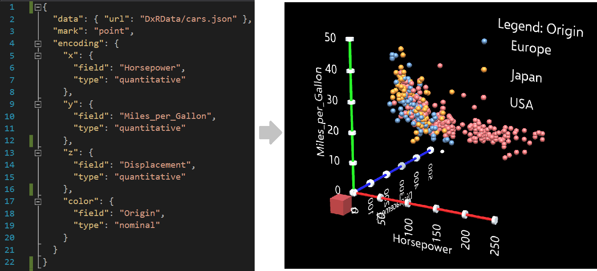

### DxR Toolkit for Fast Authoring of Immersive Visualizations
DxR is a [Unity](https://unity3d.com/unity) package that makes it easy to create interactive data-driven graphics in augmented reality (AR) and virtual reality (VR) or XR for short, i.e., immersive visualizations. Inspired by [Vega-Lite](https://vega.github.io/vega-lite/), DxR uses a concise declarative JSON specification to rapidly generate immersive visualizations.

To learn more, check out the example and gallery previews below, as well as the following links:

* [Project Website](https://sites.google.com/view/dxr-vis) (has all other links below)
* [Quick Start Guide](https://sites.google.com/view/dxr-vis/tutorials/quick-start-guide)
* [Tutorials](https://sites.google.com/view/dxr-vis/tutorials)
* [Grammar Documentation](https://sites.google.com/view/dxr-vis/grammar-docs)
* [Examples Gallery](https://sites.google.com/view/dxr-vis/examples)

As a simple example, below, given a concise JSON specification (left) from the user, DxR generates an interactive visualization (right) in Unity. 

Below are some visualization examples generated using DxR.

DxR is mainly developed by [Ronell Sicat](www.ronellsicat.com), and [Jiabao Li](https://www.jiabaoli.org/), in collaboration with Hanspeter Pfister, Benjamin Bach, and Maxime Cordeil.
