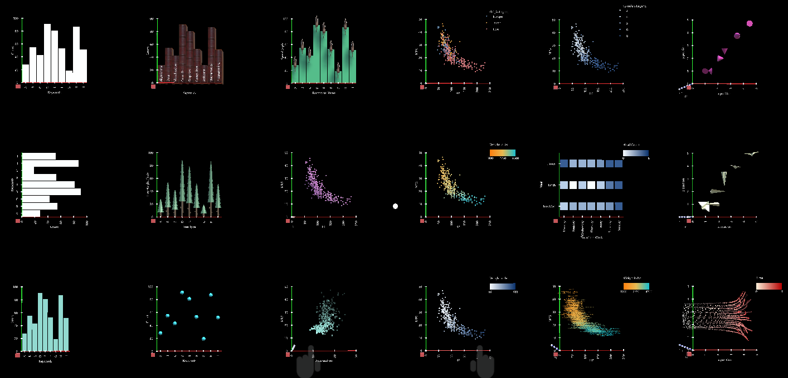

# DxR
DxR makes it easy to create Data-driven graphics for applications in xR (Mixed/Virtual/Augmented Reality), using the Unity game engine and Microsoft's Mixed Reality ecosystem. Inspired by [Vega-Lite](https://vega.github.io/vega-lite/), DxR uses declarative JSON syntax to generate visualizations. Some examples are shown below. You will find [more examples in the gallery](GALLERY.md).

You will find helpful instructions using the following links:

1. [Setup](SETUP.md)
2. [Authoring](AUTHORING.md)
3. [Development](DEVELOPMENT.md)
4. [Examples Gallery](GALLERY.md)

## Quick Start Guide

1. Install Unity3D editor [version 2017.2.0p1-MRTP4](http://beta.unity3d.com/download/b1565bfe4a0c/UnityDownloadAssistant.exe).
2. Import [DxR.unitypackage](https://github.com/ronellsicat/DxR/raw/master/DxR.unitypackage) into your project.
3. Open DxRExamples/template.unity.
4. Apply default mixed reality project settings. In Unity3D editor menu, go to: Mixed Reality Toolkit -> Configure -> Apply Mixed Reality Project Settings and click Apply.
5. If your Immersive Head-Mounted-Display (IHMD) or HoloLens is connected and setup, press play - you should see a simple DxR data visualization in your immersive environment. If no device is connected, turn off VR Support (File -> Build Settings -> Player Settings -> UWP tab -> XR Settings -> uncheck VR Supported) and press play to view scene in the editor. Detailed setup instructions can be found [here](SETUP.md).
6. To modify a visualization, select a DxRSceneObject in the scene and edit its specification file. Detailed instructions can be found [here](AUTHORING.md).
