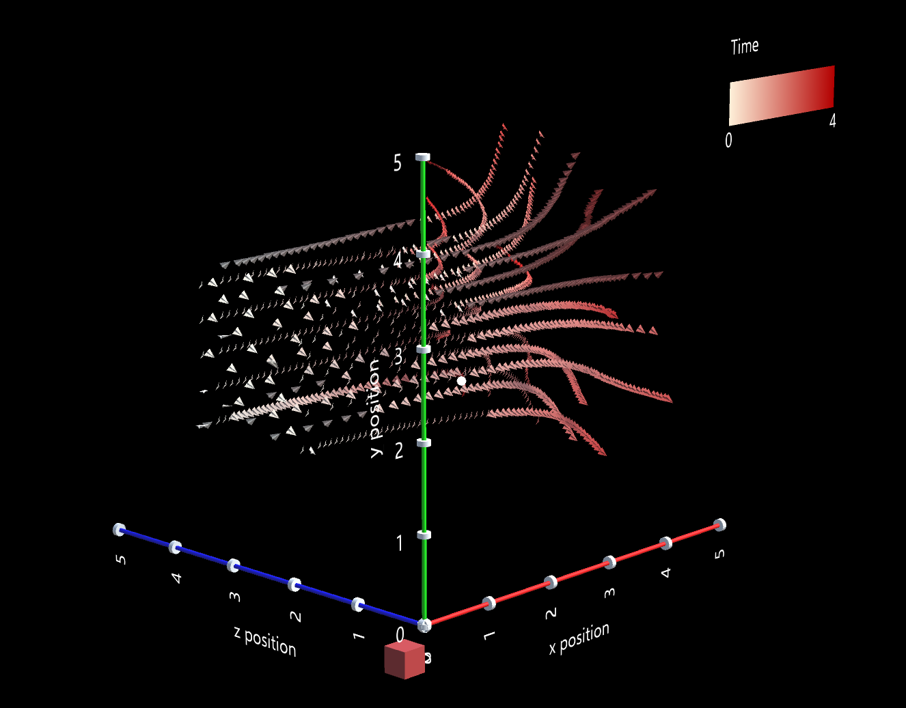

## DxR Toolkit for Fast Authoring of Immersive Visualizations

DxR is a Unity package that makes it easy and fast to create immersive visualizations, i.e., interactive data-driven graphics in augmented and virtual reality environments. Inspired by Vega-Lite, DxR uses a concise declarative JSON syntax to rapidly generate visualizations to support immersive analytics. In addition to supporting the core grammar of graphics, DxR provides a grammar of immersive interactions. DxR builds around Microsoft’s mixed reality ecosystem, mainly supporting HoloLens and IHMD (immersive head-mounted device) application development.

To learn more, check out the [tutorials](tutorials.html), [documentation](documentation.html), and [examples gallery](examples.html). 
<!-- You can also read our pre-publication paper for more detail. -->

For feedback, please comment below or contact @HarvardVCG on twitter. For issues and feature requests, please [click here](https://github.com/ronellsicat/DxR/issues?state=open).

<!--
# Examples

From a few lines of declarative JSON specification (left), DxR generates an interactive visualization in Unity (right) that can be used in AR/VR applications.

DxR makes it easy to add custom marks and channels to enable engaging visualization designs. In this example, a 3D paper plane is used as mark to visualize air flow.

-->

## Contributors

DxR is mainly developed by [Ronell Sicat](www.ronellsicat.com), and [Jiabao Li](https://www.jiabaoli.org/), in collaboration with Hanspeter Pfister, Benjamin Bach, and Maxime Cordeil.

## Comments
