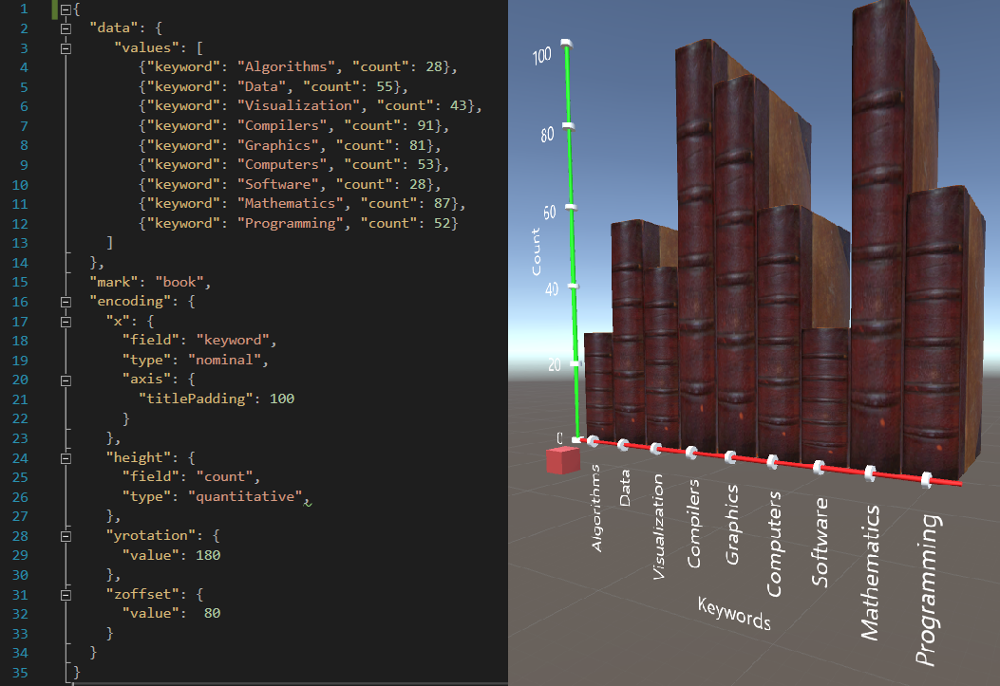

## DxR Toolkit for Fast Authoring of Immersive Visualizations

#### DxR is a [Unity](https://unity3d.com/unity) package that makes it easy to create interactive data-driven graphics in augmented reality (AR) and virtual reality (VR) environments, i.e., immersive visualizations. Inspired by [Vega-Lite](https://vega.github.io/vega-lite/), DxR uses a concise declarative JSON syntax to rapidly generate immersive visualizations.

DxR aims to bridge the development gap between data visualizations and immersive applications by combining [Vega-Lite](https://vega.github.io/vega-lite/)'s easy-to-learn/use syntax with [Unity](https://unity3d.com/unity)'s  powerful AR/VR development platform (with [Microsoft's mixed reality ecosystem](https://developer.microsoft.com/en-us/windows/mixed-reality/academy)). Like Vega-Lite, DxR constructs a visualization given a specification based on a high-level grammar of graphics describing the mapping from data attributes to visual channels of graphical marks. While Vega-Lite focuses on supporting data analysis (by providing data and visual transformations) on a 2D display/browser, DxR focuses on supporting immersive analytics in 3D environments (embedded vis in AR, data-driven scenes in VR) with immersive interactions beyond the desktop.

To learn more, check out the examples below, or the [quick start guide](site/tutorials/quickstart.html), [tutorials](site/tutorials.html), [documentation](site/documentation.html), and [examples gallery](site/examples.html).
<!-- You can also read our pre-publication paper for more detail. -->

For feedback, please comment below or contact [@HarvardVCG](https://twitter.com/HarvardVCG) on twitter. For issues and feature requests, please [click here](https://github.com/ronellsicat/DxR/issues?state=open).

### Examples

From a few lines of DxR specification in JSON (left), DxR generates an interactive visualization in Unity (right) that can be used in AR/VR applications.

DxR's grammar can be easily extended with custom marks and channels for more engaging visualizations like the embedded keyword data visualization below.

### Contributors

DxR is mainly developed by [Ronell Sicat](www.ronellsicat.com), and [Jiabao Li](https://www.jiabaoli.org/), in collaboration with Hanspeter Pfister, Benjamin Bach, and Maxime Cordeil.
