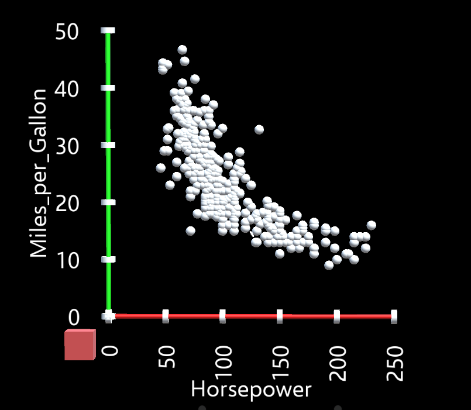

## Quick Start Guide

This guide is for users who are familiar with Unity development and Vega-Lite's JSON syntax. By the end of this guide, you will have set-up your development environment and created your first DxR visualization.

### Initial Set-up

DxR is a Unity package that builds around Microsoft’s mixed reality ecosystem, mainly supporting HoloLens and IHMD (immersive head-mounted device) application development. Follow the instructions below to set up your Unity development environment and open a template scene to make sure everything works properly.

1. Install Unity3D editor [version 2017.2.0p1-MRTP4](http://beta.unity3d.com/download/b1565bfe4a0c/UnityDownloadAssistant.exe).
2. Download, then import [DxR.unitypackage](https://github.com/ronellsicat/DxR/raw/master/DxR.unitypackage) into your project.
3. Open the template scene: Assets/DxRExamples/template.unity.
4. Apply default mixed reality project settings. In Unity editor menu, go to: Mixed Reality Toolkit -> Configure -> Apply Mixed Reality Project Settings, then click Apply.
5. If your Immersive Head-Mounted-Display (IHMD) or HoloLens is connected and ready, press play (or Ctrl+P). You should see a scatter plot visualization in front of you. If no device is connected, turn off VR Support (File -> Build Settings -> Player Settings -> UWP tab -> XR Settings -> uncheck VR Supported) and press play to view the scene in the Unity editor. You should see a 2D scatter plot like below.



### Creating Your First Visualization

A visualization in DxR, is a collection of Unity game objects whose visual properties (position, color, size, etc.) are data-driven. In order to create a visualization, you simply have to create an instance of a DxRSceneObject prefab in your scene and modify the JSON specification associated with it (to see/edit the JSON filename, click on the DxRSceneObject game object and look for "Specs Filename" attribute in the Inspector). The template scene that you have opened contains one DxRSceneObject. Let's try to modify the visualization by editing the JSON specification.

1. Open the JSON specification file using your favorite JSON text editor (e.g., Visual Studio, Atom). The file should be in Assets/StreamingAssets/DxRSpecs/template.json.
2. The current visualization described in the specification is a 2D scatterplot of the Horsepower and Miles_per_Gallon attributes of the cars data set (can be found in Assets/StreamingAssets/DxRData/cars.json). Let's turn it into a 3D scatterplot and use the color channel. Add the following to the encoding specifications: 
```json
    "z": {
      "field": "Displacement",
      "type": "quantitative"
    },
    "color": {
      "field": "Origin",
      "type": "nominal"
    }
```

3. Save the JSON file, which should now look like below (left), then re-play your application. You should now see a colored 3D scatter plot like below (right).

